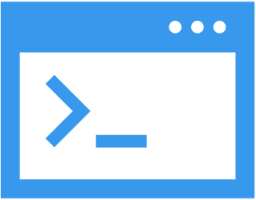

# Open. Modular. Flexible. Cross-Platform

## The most flexible cross-platform framework for modern CLI terminals.
`pi-cli` is the flexible cross-platform framework for building modern CLI terminals for your company, product, service, SaaS, development, and testing needs. Users, customers, and enterprises across engineering, manufacturing, technology, artificial intelligence, machine learning, finance, media, creative design, etc., can create simple CLI apps with few flags or advanced CLIs with roots, groups, and subcommands arguments, and options. 

> ***Take your app, service, or tool to the command line with Unicode support and build CLI terminals in any user language.***

- Configure your CLI terminal using microservices-based architecture principles, Dependency Injection(DI services), and options pattern.
- Use ready-to-use default handlers or provide custom implementations to handle terminal UX, command parsing, error handling, command validations, storage and type checking.
- Provide self-hosting implementations for stores and host in an environment of your choice, e.g., Windows, Linux, macOS, Docker, Kubernetes, etc. 
- Build deployment agnostic CLI terminals with all dependencies, test them in local environments and deploy the production terminals on-premise, cloud (public, private, or government), or hybrid.
- Collaborate in an open source environment, troubleshoot issues, and provide your feedback on the features and documentation
- Use demo license for quick onboarding, testing and evaluating read-to-use samples on GitHub, no account needed.

The framework handles the entire CLI infrastructure, so your focus is on building modern CLI apps and services.  Our ready-to-use templates and sample tutorials will get you started in no time. The software license and pricing model is flexible and fits all, whether you are a community member, solo entrepreneur, small-medium business, large enterprise, or a service vendor.

> ***In short, if what you want to achieve is doable in the .NET ecosystem, it is possible with `pi-cli`.***

# Repo
This repository contains the source and test for `pi-cli` framework. We build the following NuGet packages from this repository.

We track the [issues and tasks](https://github.com/perpetualintelligence/cli/issues) here. We make our best effort to respond to issues in a timely fashion. You can read more about our procedures for classifying and resolving issues in our [Issues policy](https://terms.perpetualintelligence.com/articles/issues-policy.html) topic.

This project has adopted the code of conduct defined by the Contributor Covenant to clarify expected behavior in our community.
See the [Code of Conduct](https://terms.perpetualintelligence.com/articles/CODE_OF_CONDUCT.html).

# License and Pricing

**See our [licensing terms](https://terms.perpetualintelligence.com/articles/licensing.html), [redistribution terms](https://terms.perpetualintelligence.com/articles/redistribution.html) and [pricing](https://www.perpetualintelligence.com/products/picli#pricing)**.

Use our [demo license](https://docs.perpetualintelligence.com/articles/pi-demo/intro.html) feature for quick onboarding, evaluation, and testing our sample code base on GitHub. We recommend creating an account to generate a license for your specific use case. Our community edition is free for educational, research and development, and non-commercial use.

> **You need a commercial license for non-educational or production environments.**

# Documentation
The documentation and code samples are hosted in our [docs](https://github.com/perpetualintelligence/docs) repository.
